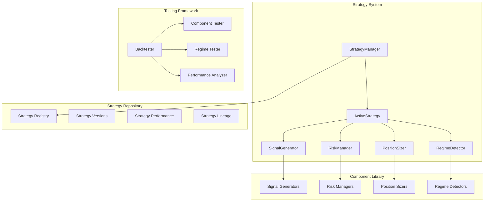

# Strategy System Redesign - Design Document

## Overview

This design document outlines a simplified, component-based strategy architecture that eliminates the current confusion between regime-aware strategies, ensemble strategies, and hot-swapping systems. The new architecture focuses on composable components, clear separation of concerns, and comprehensive testing capabilities.

## Architecture

### Core Principles

1. **Single Strategy Execution Path**: One primary strategy runs at a time, with internal regime adaptation
2. **Component Composition**: Strategies are built from pluggable, testable components
3. **Regime Awareness**: Built into components rather than external switching systems
4. **Testability**: Every component can be tested in isolation and in specific market regimes
5. **Evolutionary Development**: Easy duplication, modification, and performance comparison

### High-Level Architecture



## Components and Interfaces

### 1. Strategy Manager

The `StrategyManager` is responsible for strategy lifecycle management, versioning, and performance tracking.

```python
class StrategyManager:
    def create_strategy(self, name: str, template: str = "basic") -> Strategy
    def duplicate_strategy(self, source_id: str, new_name: str) -> Strategy
    def get_active_strategy() -> Strategy
    def set_active_strategy(strategy_id: str) -> bool
    def compare_strategies(strategy_ids: List[str]) -> PerformanceComparison
    def get_strategy_lineage(strategy_id: str) -> StrategyLineage
```

### 2. Composable Strategy

The new `Strategy` class is built from pluggable components:

```python
class Strategy:
    def __init__(self, 
                 signal_generator: SignalGenerator,
                 risk_manager: RiskManager,
                 position_sizer: PositionSizer,
                 regime_detector: RegimeDetector):
        self.signal_generator = signal_generator
        self.risk_manager = risk_manager
        self.position_sizer = position_sizer
        self.regime_detector = regime_detector
        
    def process_candle(self, df: pd.DataFrame, index: int) -> TradingDecision
    def get_regime_context(self, df: pd.DataFrame, index: int) -> RegimeContext
```

### 3. Signal Generator Components

Signal generators produce buy/sell/hold signals based on market data:

```python
class SignalGenerator(ABC):
    @abstractmethod
    def generate_signal(self, df: pd.DataFrame, index: int, regime: RegimeContext) -> Signal
    
    @abstractmethod
    def get_confidence(self, df: pd.DataFrame, index: int) -> float

@dataclass
class Signal:
    direction: SignalDirection  # BUY, SELL, HOLD
    strength: float  # 0.0 to 1.0
    confidence: float  # 0.0 to 1.0
    metadata: Dict[str, Any]  # Additional signal information

class SignalDirection(Enum):
    BUY = "buy"
    SELL = "sell"
    HOLD = "hold"

# Implementations:
class MLSignalGenerator(SignalGenerator)  # ML-based signals
class TechnicalSignalGenerator(SignalGenerator)  # Technical indicators
class SentimentSignalGenerator(SignalGenerator)  # Sentiment-based
class EnsembleSignalGenerator(SignalGenerator)  # Combines multiple generators

# Example: Combining multiple signal sources
class MultiSourceSignalGenerator(SignalGenerator):
    def __init__(self, generators: List[SignalGenerator], weights: Dict[str, float]):
        self.generators = generators
        self.weights = weights  # e.g., {"ml": 0.4, "sentiment": 0.3, "technical": 0.3}
    
    def generate_signal(self, df: pd.DataFrame, index: int, regime: RegimeContext) -> Signal:
        signals = []
        confidences = []
        
        for generator in self.generators:
            signal = generator.generate_signal(df, index, regime)
            confidence = generator.get_confidence(df, index)
            signals.append(signal)
            confidences.append(confidence)
        
        # Weighted combination based on confidence and predefined weights
        final_signal = self._combine_signals(signals, confidences)
        return final_signal
    
    def _combine_signals(self, signals: List[Signal], confidences: List[float]) -> Signal:
        # Implementation of signal combination logic
        # Could use voting, weighted averaging, or more sophisticated methods
        pass
```

### 4. Risk Manager Components

Risk managers handle position sizing, stop losses, and risk controls:

```python
class RiskManager(ABC):
    @abstractmethod
    def calculate_position_size(self, signal: Signal, balance: float, regime: RegimeContext) -> float
    
    @abstractmethod
    def should_exit(self, position: Position, current_data: MarketData, regime: RegimeContext) -> bool
    
    @abstractmethod
    def get_stop_loss(self, entry_price: float, signal: Signal, regime: RegimeContext) -> float

# Implementations:
class FixedRiskManager(RiskManager)  # Fixed percentage risk
class VolatilityRiskManager(RiskManager)  # ATR-based risk
class RegimeAdaptiveRiskManager(RiskManager)  # Regime-specific risk
class MLRiskManager(RiskManager)  # ML-predicted risk
```

### 5. Position Sizer Components

Position sizers determine trade size based on various factors:

```python
class PositionSizer(ABC):
    @abstractmethod
    def calculate_size(self, signal: Signal, balance: float, risk_amount: float, regime: RegimeContext) -> float

# Implementations:
class FixedFractionSizer(PositionSizer)  # Fixed percentage of balance
class KellySizer(PositionSizer)  # Kelly criterion
class ConfidenceWeightedSizer(PositionSizer)  # Based on signal confidence
class RegimeAdaptiveSizer(PositionSizer)  # Regime-specific sizing
```

### 6. Regime Detector

Enhanced regime detection with component-specific adaptations:

```python
class RegimeDetector:
    def detect_regime(self, df: pd.DataFrame, index: int) -> RegimeContext
    def get_regime_history(self, df: pd.DataFrame) -> List[RegimeContext]
    def is_regime_stable(self, df: pd.DataFrame, index: int, min_duration: int) -> bool

@dataclass
class RegimeContext:
    trend: TrendLabel  # BULL, BEAR, RANGE
    volatility: VolLabel  # HIGH, LOW
    confidence: float
    duration: int
    strength: float
```

## Signal Combination Strategies

### Approach 1: Weighted Voting
```python
class WeightedVotingSignalGenerator(SignalGenerator):
    def __init__(self, generators: Dict[str, SignalGenerator], weights: Dict[str, float]):
        self.generators = generators  # {"ml": MLGenerator(), "sentiment": SentimentGenerator()}
        self.weights = weights        # {"ml": 0.6, "sentiment": 0.4}
    
    def generate_signal(self, df: pd.DataFrame, index: int, regime: RegimeContext) -> Signal:
        weighted_score = 0.0
        total_confidence = 0.0
        
        for name, generator in self.generators.items():
            signal = generator.generate_signal(df, index, regime)
            confidence = generator.get_confidence(df, index)
            weight = self.weights[name]
            
            # Convert signal to numeric score (-1 to 1)
            score = self._signal_to_score(signal)
            weighted_score += score * weight * confidence
            total_confidence += confidence * weight
        
        # Convert back to signal
        return self._score_to_signal(weighted_score, total_confidence)
```

### Approach 2: Hierarchical Decision Tree
```python
class HierarchicalSignalGenerator(SignalGenerator):
    def __init__(self, primary: SignalGenerator, secondary: List[SignalGenerator]):
        self.primary = primary      # Main signal source (e.g., ML)
        self.secondary = secondary  # Confirmation sources (e.g., sentiment, technical)
    
    def generate_signal(self, df: pd.DataFrame, index: int, regime: RegimeContext) -> Signal:
        primary_signal = self.primary.generate_signal(df, index, regime)
        primary_confidence = self.primary.get_confidence(df, index)
        
        # If primary signal is strong and confident, use it
        if primary_confidence > 0.8 and primary_signal.strength > 0.7:
            return primary_signal
        
        # Otherwise, check for confirmation from secondary sources
        confirmations = 0
        for generator in self.secondary:
            secondary_signal = generator.generate_signal(df, index, regime)
            if secondary_signal.direction == primary_signal.direction:
                confirmations += 1
        
        # Adjust confidence based on confirmations
        confirmation_ratio = confirmations / len(self.secondary)
        adjusted_confidence = primary_confidence * (0.5 + 0.5 * confirmation_ratio)
        
        return Signal(
            direction=primary_signal.direction,
            strength=primary_signal.strength,
            confidence=adjusted_confidence,
            metadata={"confirmations": confirmations, "primary_confidence": primary_confidence}
        )
```

### Approach 3: Regime-Specific Combination
```python
class RegimeAdaptiveSignalGenerator(SignalGenerator):
    def __init__(self, regime_strategies: Dict[str, SignalGenerator]):
        # Different combination strategies for different regimes
        self.regime_strategies = {
            "bull_low_vol": WeightedVotingSignalGenerator({"ml": 0.7, "technical": 0.3}),
            "bull_high_vol": HierarchicalSignalGenerator(ml_gen, [sentiment_gen]),
            "bear_low_vol": WeightedVotingSignalGenerator({"sentiment": 0.6, "technical": 0.4}),
            "bear_high_vol": ConservativeSignalGenerator(),  # Very conservative in volatile bear
            "range_low_vol": MLSignalGenerator(),  # Pure ML in range markets
            "range_high_vol": HoldSignalGenerator()  # Stay out of volatile range markets
        }
    
    def generate_signal(self, df: pd.DataFrame, index: int, regime: RegimeContext) -> Signal:
        regime_key = f"{regime.trend.value}_{regime.volatility.value}"
        strategy = self.regime_strategies.get(regime_key, self.regime_strategies["range_low_vol"])
        return strategy.generate_signal(df, index, regime)
```

## Data Models

### Strategy Definition

```python
@dataclass
class StrategyDefinition:
    id: str
    name: str
    version: str
    parent_id: Optional[str]  # For lineage tracking
    created_at: datetime
    components: StrategyComponents
    parameters: Dict[str, Any]
    performance_metrics: PerformanceMetrics
    status: StrategyStatus  # EXPERIMENTAL, TESTING, PRODUCTION, RETIRED

@dataclass
class StrategyComponents:
    signal_generator: ComponentConfig
    risk_manager: ComponentConfig
    position_sizer: ComponentConfig
    regime_detector: ComponentConfig

@dataclass
class ComponentConfig:
    type: str
    parameters: Dict[str, Any]
    version: str
```

### Performance Tracking

```python
@dataclass
class PerformanceMetrics:
    total_return: float
    sharpe_ratio: float
    max_drawdown: float
    win_rate: float
    regime_performance: Dict[str, RegimePerformance]
    component_attribution: Dict[str, float]

@dataclass
class RegimePerformance:
    regime_type: str
    total_return: float
    trade_count: int
    win_rate: float
    avg_trade_duration: timedelta
```

## Error Handling

### Component Failure Handling

1. **Signal Generator Failure**: Fall back to previous signal or neutral signal
2. **Risk Manager Failure**: Use conservative default risk parameters
3. **Position Sizer Failure**: Use minimum position size
4. **Regime Detector Failure**: Assume neutral regime

### Strategy Switching

1. **Performance Degradation Detection**: Multi-layered approach to avoid premature switching
   - **Statistical Significance**: Require statistically significant underperformance over minimum sample size (e.g., 50+ trades)
   - **Time-Based Thresholds**: Multiple time horizons (7-day, 30-day, 90-day) must all show degradation
   - **Drawdown Limits**: Only trigger on severe drawdown (e.g., >20%) combined with poor recent performance
   - **Confidence Intervals**: Compare performance against historical confidence intervals, not just raw returns
   - **Market Regime Context**: Account for whether poor performance is regime-specific or systematic

2. **Fallback Strategy Selection**: Intelligent selection of replacement strategy
   - **Historical Performance**: Choose strategy with best performance in current market regime
   - **Recency Weighting**: Weight recent performance more heavily than distant past
   - **Risk-Adjusted Returns**: Use Sharpe ratio and max drawdown, not just raw returns
   - **Correlation Analysis**: Avoid switching to highly correlated strategies that might fail similarly

3. **Component Updates**: Hot-swap individual components without full strategy restart
4. **Emergency Mode**: Switch to ultra-conservative strategy only for severe system failures (not performance)

## Testing Strategy

The testing framework focuses on **performance testing** and **backtesting** rather than traditional unit tests. The goal is to validate trading performance, not code correctness.

### Component-Level Performance Testing

Each component type has standardized performance test interfaces:

```python
class ComponentPerformanceTester:
    def test_signal_generator(self, generator: SignalGenerator, test_data: pd.DataFrame) -> SignalTestResults:
        """Test signal quality: accuracy, precision, recall, profitability"""
        
    def test_risk_manager(self, manager: RiskManager, test_scenarios: List[TradingScenario]) -> RiskTestResults:
        """Test risk management: drawdown control, position sizing effectiveness"""
        
    def test_position_sizer(self, sizer: PositionSizer, test_cases: List[MarketCondition]) -> SizingTestResults:
        """Test position sizing: Kelly criterion adherence, regime adaptation"""

@dataclass
class SignalTestResults:
    accuracy: float  # % of profitable signals
    precision: float  # % of buy signals that were profitable
    recall: float    # % of profitable opportunities captured
    sharpe_ratio: float  # Risk-adjusted return of signals
    regime_breakdown: Dict[str, float]  # Performance by regime

@dataclass
class RiskTestResults:
    max_drawdown_achieved: float
    average_position_size: float
    risk_adjusted_return: float
    stop_loss_effectiveness: float
    
@dataclass
class SizingTestResults:
    kelly_criterion_adherence: float
    regime_adaptation_effectiveness: float
    volatility_adjustment_quality: float
```

### Regime-Specific Testing

```python
class RegimeTester:
    def test_in_regime(self, strategy: Strategy, regime_type: str, test_data: pd.DataFrame) -> RegimeTestResults
    def compare_regime_performance(self, strategies: List[Strategy], regime_type: str) -> ComparisonResults
    def optimize_for_regime(self, strategy: Strategy, regime_type: str) -> OptimizedStrategy
```

### Strategy Performance Testing

```python
class StrategyPerformanceTester:
    def backtest_strategy(self, strategy: Strategy, test_data: pd.DataFrame) -> BacktestResults:
        """Full historical backtest with performance metrics"""
        
    def walk_forward_test(self, strategy: Strategy, data: pd.DataFrame, window_size: int) -> WalkForwardResults:
        """Rolling window backtests to test adaptability"""
        
    def monte_carlo_test(self, strategy: Strategy, scenarios: int) -> MonteCarloResults:
        """Stress test with randomized market scenarios"""
        
    def paper_trade_test(self, strategy: Strategy, duration_days: int) -> PaperTradingResults:
        """Live market testing with paper money"""

@dataclass
class BacktestResults:
    total_return: float
    sharpe_ratio: float
    max_drawdown: float
    win_rate: float
    total_trades: int
    regime_performance: Dict[str, RegimePerformance]
    component_attribution: ComponentAttribution  # Which components contributed most to performance
    
@dataclass
class ComponentAttribution:
    signal_generator_contribution: float  # % of performance attributed to signals
    risk_manager_contribution: float     # % attributed to risk management
    position_sizer_contribution: float   # % attributed to position sizing
```

### Unit Testing (Traditional Code Testing)

While the focus is on performance testing, we still need traditional unit tests for:

```python
# Traditional unit tests for code correctness
class TestSignalGenerator(unittest.TestCase):
    def test_signal_generation_no_errors(self):
        """Ensure signal generation doesn't crash"""
        
    def test_confidence_bounds(self):
        """Ensure confidence values are between 0 and 1"""
        
    def test_signal_enum_values(self):
        """Ensure signals are valid enum values"""

# But the main focus is performance testing, not unit testing
```

## Migration Strategy

### Phase 1: Test-Driven Component Extraction
1. **Audit Existing Tests**: Catalog all current unit and integration tests, identify what they're testing
2. **Create Legacy Adapters**: Build adapter classes that wrap new components to maintain existing interfaces
3. **Extract Components with Test Coverage**: 
   - Extract signal generation logic with comprehensive test coverage
   - Extract risk management logic with test coverage
   - Extract position sizing logic with test coverage
4. **Maintain Test Compatibility**: Ensure all existing tests continue to pass with adapter layer

### Phase 2: Parallel Implementation
1. **Build New System Alongside Old**: Implement new component system without removing old system
2. **Cross-Validation Testing**: Run both old and new systems on same data, compare results
3. **Test Migration Strategy**:
   - Convert existing unit tests to work with new components
   - Add new performance tests for component-level testing
   - Create integration tests that verify old and new systems produce equivalent results
4. **Gradual Component Migration**: Replace one component type at a time, not all at once

### Phase 3: Test Suite Modernization
1. **Update Unit Tests**: 
   - Convert strategy-level unit tests to component-level tests
   - Add new tests for component interfaces and contracts
   - Maintain backward compatibility tests during transition
2. **Enhanced Integration Tests**:
   - Add end-to-end tests that verify complete trading workflows
   - Add regime-specific integration tests
   - Add performance regression tests
3. **Test Data Management**: Create standardized test datasets for consistent testing

### Phase 4: Validation and Cutover
1. **Performance Parity Validation**: Prove new system matches old system performance
2. **Gradual Production Migration**: 
   - Start with paper trading
   - Move to small position sizes
   - Gradually increase to full production
3. **Rollback Capability**: Maintain ability to quickly revert to old system if issues arise
4. **Legacy Code Removal**: Only after 30+ days of successful production operation

### Test Migration Detailed Plan

```python
# Phase 1: Legacy Adapter Pattern
class LegacyStrategyAdapter(BaseStrategy):
    """Adapter to make new component-based strategies work with existing test infrastructure"""
    
    def __init__(self, signal_generator: SignalGenerator, risk_manager: RiskManager, position_sizer: PositionSizer):
        self.signal_generator = signal_generator
        self.risk_manager = risk_manager
        self.position_sizer = position_sizer
        
    # Implement all existing BaseStrategy methods to maintain compatibility
    def check_entry_conditions(self, df: pd.DataFrame, index: int) -> bool:
        regime = self._detect_regime(df, index)
        signal = self.signal_generator.generate_signal(df, index, regime)
        return signal.direction == SignalDirection.BUY
    
    # ... other methods maintain exact same interface

# Phase 2: Cross-validation testing
class SystemComparisonTest:
    def test_equivalent_results(self):
        """Verify old and new systems produce same results on historical data"""
        old_strategy = MlAdaptive()  # Legacy strategy
        new_strategy = LegacyStrategyAdapter(
            MLSignalGenerator(), 
            VolatilityRiskManager(), 
            ConfidenceWeightedSizer()
        )
        
        # Run both on same data
        old_results = backtest_engine.run(old_strategy, test_data)
        new_results = backtest_engine.run(new_strategy, test_data)
        
        # Assert results are equivalent (within tolerance)
        assert abs(old_results.total_return - new_results.total_return) < 0.01
        assert abs(old_results.sharpe_ratio - new_results.sharpe_ratio) < 0.05

# Phase 3: Test suite updates
class TestSignalGeneratorMigration:
    """Example of how to migrate existing strategy tests to component tests"""
    
    def test_ml_adaptive_signal_generation(self):
        # Old test tested entire MlAdaptive strategy
        # New test focuses just on signal generation component
        generator = MLSignalGenerator()
        signal = generator.generate_signal(test_data, 100, regime_context)
        
        assert signal.direction in [SignalDirection.BUY, SignalDirection.SELL, SignalDirection.HOLD]
        assert 0 <= signal.confidence <= 1
        assert 0 <= signal.strength <= 1
```

### Risk Mitigation for Test Failures

1. **Incremental Migration**: Never migrate all tests at once
2. **Automated Test Monitoring**: Set up CI/CD to catch test failures immediately
3. **Performance Benchmarking**: Establish performance baselines before migration
4. **Rollback Procedures**: Document exact steps to revert any migration step
5. **Test Coverage Metrics**: Ensure test coverage doesn't decrease during migration
6. **Staging Environment**: Test all changes in staging environment first

### Test Quality Assurance

```python
class MigrationTestSuite:
    """Comprehensive test suite to validate migration quality"""
    
    def test_no_performance_regression(self):
        """Ensure new system performs at least as well as old system"""
        
    def test_all_edge_cases_covered(self):
        """Ensure edge cases from old tests are covered in new tests"""
        
    def test_component_isolation(self):
        """Ensure components can be tested independently"""
        
    def test_integration_completeness(self):
        """Ensure all component interactions are tested"""
```

## Performance Considerations

### Memory Usage
- Component instances are lightweight and reusable
- Strategy definitions stored efficiently with shared component references
- Historical performance data compressed and indexed

### Execution Speed
- Components designed for fast execution in trading loops
- Regime detection cached to avoid recalculation
- Signal generation optimized for real-time processing

### Scalability
- Component library grows independently of strategy count
- New strategies can reuse existing, tested components
- Performance tracking scales with number of strategies and time periods

## Performance Monitoring and Strategy Switching

### Performance Degradation Criteria

```python
@dataclass
class PerformanceDegradationConfig:
    # Statistical requirements
    min_trades_for_evaluation: int = 50  # Need sufficient sample size
    min_days_for_evaluation: int = 30    # Need sufficient time period
    
    # Multi-timeframe thresholds
    short_term_days: int = 7
    medium_term_days: int = 30
    long_term_days: int = 90
    
    # Performance thresholds (all must be met)
    max_drawdown_threshold: float = 0.20  # 20% max drawdown
    sharpe_ratio_threshold: float = 0.5   # Minimum acceptable Sharpe
    win_rate_threshold: float = 0.35      # Minimum win rate
    
    # Statistical significance
    confidence_level: float = 0.95        # 95% confidence for underperformance
    
    # Regime-specific considerations
    regime_specific_evaluation: bool = True  # Evaluate performance within current regime
    min_regime_duration_days: int = 14      # Don't switch during regime transitions

class PerformanceMonitor:
    def should_switch_strategy(self, current_strategy: Strategy, 
                             performance_history: PerformanceHistory,
                             market_data: pd.DataFrame) -> SwitchDecision:
        
        # 1. Check minimum requirements
        if not self._meets_minimum_requirements(performance_history):
            return SwitchDecision(should_switch=False, reason="Insufficient data")
        
        # 2. Multi-timeframe analysis
        timeframe_results = self._analyze_multiple_timeframes(performance_history)
        if not all(result.underperforming for result in timeframe_results):
            return SwitchDecision(should_switch=False, reason="Not underperforming across all timeframes")
        
        # 3. Statistical significance test
        if not self._is_statistically_significant(performance_history):
            return SwitchDecision(should_switch=False, reason="Underperformance not statistically significant")
        
        # 4. Regime context analysis
        current_regime = self._get_current_regime(market_data)
        if self._is_regime_transition_period(market_data):
            return SwitchDecision(should_switch=False, reason="In regime transition period")
        
        # 5. Select best alternative strategy
        alternative = self._select_best_alternative(current_regime, performance_history)
        
        return SwitchDecision(
            should_switch=True,
            reason="Multi-criteria performance degradation detected",
            recommended_strategy=alternative,
            confidence=self._calculate_switch_confidence(timeframe_results)
        )
```

### Fallback Strategy Selection

```python
class StrategySelector:
    def select_best_alternative(self, current_regime: RegimeContext, 
                              available_strategies: List[Strategy]) -> Strategy:
        
        # Score each strategy based on multiple criteria
        strategy_scores = []
        
        for strategy in available_strategies:
            score = self._calculate_strategy_score(strategy, current_regime)
            strategy_scores.append((strategy, score))
        
        # Sort by score and return best
        strategy_scores.sort(key=lambda x: x[1], reverse=True)
        return strategy_scores[0][0]
    
    def _calculate_strategy_score(self, strategy: Strategy, regime: RegimeContext) -> float:
        # Multi-factor scoring
        regime_performance = strategy.get_regime_performance(regime.trend, regime.volatility)
        recent_performance = strategy.get_recent_performance(days=30)
        risk_adjusted_return = recent_performance.sharpe_ratio
        max_drawdown_penalty = max(0, 1 - regime_performance.max_drawdown / 0.15)  # Penalize high drawdown
        
        # Weighted combination
        score = (
            regime_performance.total_return * 0.3 +
            risk_adjusted_return * 0.4 +
            max_drawdown_penalty * 0.2 +
            regime_performance.win_rate * 0.1
        )
        
        return score
```

### Preventing Premature Switching

1. **Cooling-off Period**: After switching strategies, wait minimum 14 days before allowing another switch
2. **Performance Buffer**: Require new strategy to outperform by meaningful margin (e.g., 2% better Sharpe ratio)
3. **Regime Stability**: Only switch during stable regime periods, not during transitions
4. **Confidence Thresholds**: Require high confidence (>80%) in switch decision
5. **Manual Override**: Allow manual intervention to prevent or force switches

## Security Considerations

### Strategy Isolation
- Each strategy runs in isolated context
- Component failures don't affect other strategies
- Parameter validation prevents malicious inputs

### Version Control
- All strategy changes tracked and auditable
- Rollback capability for any strategy version
- Performance impact of changes measurable

### Access Control
- Strategy creation/modification requires appropriate permissions
- Production strategy changes require approval workflow
- Component library changes affect multiple strategies, require careful review